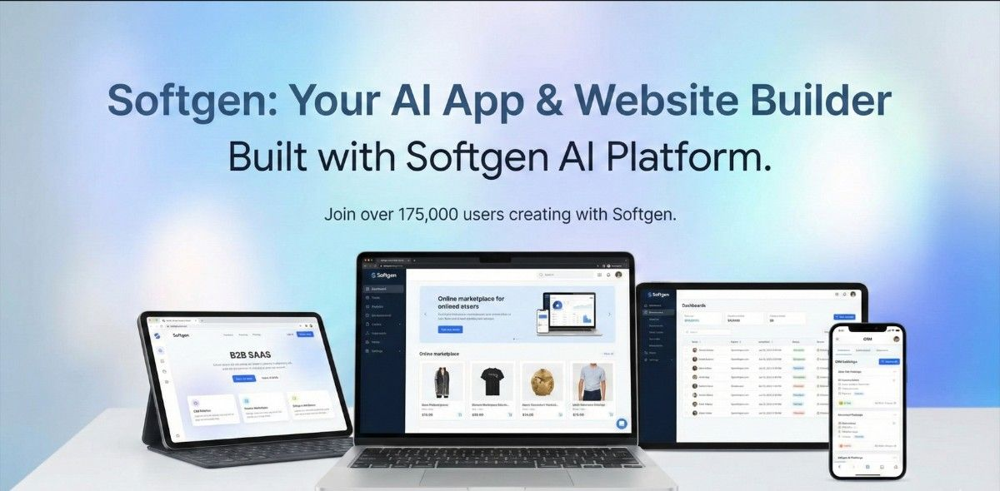

# Opportunity Finder

> **Discover. Engage. Convert.**

An enterprise-grade lead intelligence and outreach automation platform designed for New Brunswick businesses.



---

## 🌟 Features

### Lead Intelligence
- **Smart Lead Discovery** - AI-powered business data aggregation
- **Advanced Filtering** - Search by industry, location, rating, and score
- **Lead Scoring Engine** - Multi-factor scoring algorithm (0-100)
- **Geographic Visualization** - Interactive map with clustering

### Email Automation
- **AI Proposal Generation** - Personalized business proposals
- **Campaign Management** - Schedule and track email campaigns
- **Engagement Tracking** - Monitor opens, clicks, and replies
- **Automated Follow-ups** - Smart drip campaigns

### Analytics & Insights
- **Performance Dashboard** - Real-time metrics and KPIs
- **Conversion Tracking** - Funnel analysis and attribution
- **Lead Intelligence** - AI-powered recommendations
- **Export Capabilities** - CSV, Excel, PDF reports

---

## 🚀 Quick Start

### Prerequisites

- Node.js 18+
- PostgreSQL 14+
- Redis 7+
- npm or yarn

### Installation

```bash
# Clone repository
git clone https://github.com/your-org/opportunity-finder.git
cd opportunity-finder

# Install dependencies
npm install

# Setup environment
cp .env.example .env.local
# Edit .env.local with your configuration

# Run development server
npm run dev
```

Open [http://localhost:3000](http://localhost:3000) to view the application.

---

## 📁 Project Structure

```
opportunity-finder/
├── src/
│   ├── components/          # React components
│   │   ├── ai/             # AI features (proposals, scoring)
│   │   ├── common/         # Shared components
│   │   ├── layouts/        # Layout components
│   │   └── ui/             # UI component library
│   ├── contexts/           # React contexts
│   ├── hooks/              # Custom hooks
│   ├── lib/                # Utilities and libraries
│   │   ├── ai/            # AI engines
│   │   ├── api/           # API client
│   │   └── utils/         # Helper functions
│   ├── pages/              # Next.js pages
│   │   ├── api/           # API routes
│   │   ├── auth/          # Authentication pages
│   │   └── dashboard/     # Dashboard pages
│   ├── styles/             # Global styles
│   └── types/              # TypeScript types
├── public/                 # Static assets
├── ARCHITECTURE.md         # System architecture
├── DEPLOYMENT.md          # Deployment guide
└── package.json
```

---

## 🛠 Technology Stack

### Frontend
- **Framework**: Next.js 15.2 (Pages Router)
- **Language**: TypeScript
- **Styling**: Tailwind CSS v3.4
- **UI Library**: Shadcn/UI
- **Icons**: Lucide React
- **Forms**: React Hook Form + Zod
- **Animations**: Framer Motion

### Backend (API)
- **Framework**: NestJS (Node.js) or Django (Python)
- **Database**: PostgreSQL
- **Cache/Queue**: Redis + BullMQ
- **Search**: Elasticsearch
- **Email**: SendGrid / AWS SES

### Infrastructure
- **Hosting**: Vercel / AWS / GCP
- **CDN**: Cloudflare
- **Monitoring**: Sentry
- **Analytics**: Google Analytics / Mixpanel

---

## 🔧 Development

### Available Scripts

```bash
# Development
npm run dev          # Start dev server
npm run build        # Production build
npm run start        # Start production server
npm run lint         # Run ESLint
npm run type-check   # TypeScript checking

# Database
npm run db:migrate   # Run migrations
npm run db:seed      # Seed database
npm run db:reset     # Reset database
```

### Environment Variables

See `.env.example` for all required environment variables.

**Critical Variables:**
- `DATABASE_URL` - PostgreSQL connection string
- `REDIS_URL` - Redis connection string
- `SENDGRID_API_KEY` - Email service API key
- `NEXT_PUBLIC_GOOGLE_MAPS_API_KEY` - Google Maps API key
- `JWT_SECRET` - Authentication secret

---

## 🤖 AI Features

### Proposal Generator
- **Industry-specific templates** - 6+ professional templates
- **Personalization** - Dynamic content based on lead data
- **Tone customization** - Professional, friendly, or consultative
- **A/B testing** - Generate multiple variations

### Lead Scoring Engine
- **Multi-factor analysis** - Website, reputation, maturity, engagement
- **Weighted scoring** - Configurable weights per factor
- **Actionable insights** - AI-generated recommendations
- **Priority classification** - High, medium, low priority leads

---

## 📊 Database Schema

### Core Tables
- `leads` - Business lead information
- `campaigns` - Email campaigns
- `emails` - Individual email records
- `email_events` - Tracking events (opens, clicks)
- `templates` - Email templates
- `users` - System users
- `audit_logs` - Activity tracking

See `ARCHITECTURE.md` for complete schema.

---

## 🔒 Security

### Implemented Security Features
- ✅ HTTPS enforced
- ✅ Security headers (CSP, HSTS, X-Frame-Options)
- ✅ JWT authentication
- ✅ Rate limiting
- ✅ Input validation and sanitization
- ✅ SQL injection protection
- ✅ XSS protection
- ✅ CSRF tokens
- ✅ Environment variable encryption

### Compliance
- **CASL Compliant** - Canadian Anti-Spam Legislation
- **GDPR Ready** - Data privacy architecture
- **Ethical Scraping** - Respects robots.txt and rate limits

---

## 📈 Performance

### Optimization Techniques
- Code splitting and lazy loading
- Image optimization (AVIF, WebP)
- Database query optimization
- Redis caching
- CDN integration
- Gzip compression

### Benchmarks
- **Page Load**: < 2s
- **Time to Interactive**: < 3s
- **Lighthouse Score**: 95+
- **Database Queries**: < 100ms average

---

## 🧪 Testing

```bash
# Unit tests
npm run test

# Integration tests
npm run test:integration

# E2E tests
npm run test:e2e

# Coverage
npm run test:coverage
```

---

## 📦 Deployment

### Quick Deploy to Vercel

[](https://vercel.com/new/clone?repository-url=https://github.com/your-org/opportunity-finder)

### Manual Deployment

See `DEPLOYMENT.md` for comprehensive deployment guide covering:
- Vercel deployment
- AWS EC2 + PM2
- Docker containers
- Kubernetes
- Nginx configuration
- SSL setup

---

## 🗺 Roadmap

### Phase 1 (Current) ✅
- [x] Lead database and filtering
- [x] AI proposal generation
- [x] Lead scoring engine
- [x] Email campaign management
- [x] Analytics dashboard
- [x] Interactive map view

### Phase 2 (Q2 2026)
- [ ] Real-time web scraping integration
- [ ] Advanced AI lead insights
- [ ] Predictive lead scoring with ML
- [ ] CRM integrations (Salesforce, HubSpot)
- [ ] Mobile app (iOS/Android)
- [ ] API marketplace

### Phase 3 (Q3 2026)
- [ ] Multi-region support
- [ ] White-label solution
- [ ] Advanced automation workflows
- [ ] Voice AI for cold calling
- [ ] Video proposal generation

---

## 🤝 Contributing

We welcome contributions! Please see our contributing guidelines.

1. Fork the repository
2. Create a feature branch (`git checkout -b feature/amazing-feature`)
3. Commit changes (`git commit -m 'Add amazing feature'`)
4. Push to branch (`git push origin feature/amazing-feature`)
5. Open a Pull Request

---

## 📄 License

Copyright © 2026 Opportunity Finder. All rights reserved.

---

## 💬 Support

- **Email**: support@opportunityfinder.ca
- **Documentation**: [docs.opportunityfinder.ca](https://docs.opportunityfinder.ca)
- **GitHub Issues**: [github.com/your-org/opportunity-finder/issues](https://github.com/your-org/opportunity-finder/issues)

---

## 🙏 Acknowledgments

- New Brunswick business community
- Open source contributors
- Early beta testers

---

**Built with ❤️ in New Brunswick, Canada**